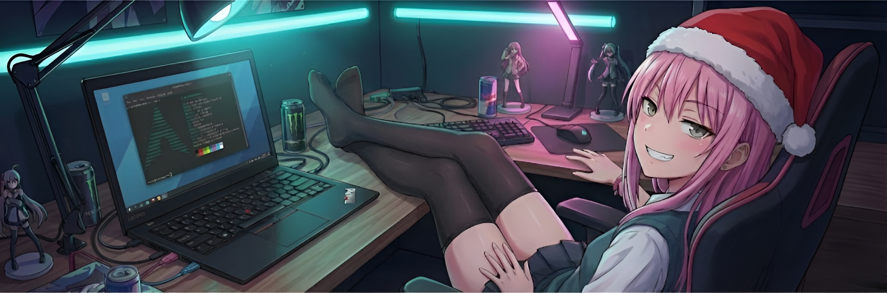

  

<h1 align="center" style="font-weight: 800; display: flex; align-items: center; justify-content: center; gap: 10px;">
  Здоров, киця, я izachoc! 
  
</h1>

 

  <pre style="
    display: inline-block;
    background: #0d1117;
    color: #c9d1d9;
    padding: 18px 24px;
    border-radius: 12px;
    font-size: 15px;
    width: auto;
    max-width: 450px;
    box-shadow: 0 0 20px rgba(0,0,0,0.35);
    text-align: left;
    margin: 0 auto;
    font-family: Consolas, 'Courier New', monospace;
  ">system status check...
> user: <strong>izachoc</strong>
> os: <strong>CachyOS (воно компілюється, чесно)</strong>
> education: <strong>Politekh Survivor 💀</strong>
> current_state: <strong>Під напругою ⚡ 🤤</strong>
> voltage: <strong>220V</strong>
> love_status: <strong>Node.js (Toxic Relationship) 💔</strong></pre>

 

  <h3>❄️ Vibe Check:</h3>
  

    <em>"ОООООО погода надворі свариться, 
    Але вогонь в каміні свариться... 
    І оскільки нам нема куди йти 
    <strong>Нехай падає сніг! Падає сніг! Падає сніг! 🌨️</strong>"</em>
  

  (У голові грає 24/7 замість нормальних думок)

 

<h2 align="center">🛠️ На чому я (намагаюсь) писати</h2>

  
  
  
  
  
  

 

<h2 align="center">📢 WANTED / РОЗШУК</h2>

  
<strong>Шукаю дпузів з таким самим психічним розладом!</strong> 🩺

  

    Якщо ти теж кодиш о 3-й ночі і ненавидиш цей світ, нам по дорозі.  
    <strong>Мої вимоги до кандидата:</strong> 
    ✅ Не ігнорити, коли я пишу "Добрий ранок" (це святе). 
    ✅ Відповідати на мої всраті рілси та меми. 
    ✅ Кидати у відповідь всяку фігню. 
    ✅ Розуміти, що C++ це не мова, це БДСМ. 
  

  
<em>Пишіть, дзвоніть, висилайте голубів. Контакти внизу. 👇</em>

 

<h2 align="center">🎭 Шизофренія-тайм & Мудрість Політеху</h2>

  <blockquote>
    <strong>"В жизнє лиш одна утєха — я не студент політєха... 
    (Ой бл*яха, я ж студент)"</strong> 🤡
  </blockquote>
   
  <blockquote>
    <strong>"Лучше х*єм біть арєхі, чим учітса в політєхє."</strong>  
    — Народна мудрість
  </blockquote>
   
  <blockquote>
    <strong>"Поступив у Політех — прощавай і сон, і смєх."</strong>
  </blockquote>
   
  <blockquote>
    <strong>"Сонце світить, та не гріє — Політех мене імєє."</strong>
  </blockquote>
     
  <blockquote>
    <strong>"Пари йдуть, студенти плачуть, бо вони як коні пашуть."</strong> 🐎
  </blockquote>

 
<h2 align="center">🎓 Чесний відгук про політех</h2>

  

    Поза жартами про "виживання", я насправді щиро вдячний своєму <strong>Політеху</strong>. Це місце, яке навчило мене справжній дисципліні та вмінню розв'язувати задачі будь-якої складності. Хоч я і люблю мемний вайб, але до навчання ставлюся максимально серйозно.
  

  

    <strong>Мій шлях за два курси в цифрах та фактах:</strong>
    <ul style="line-height: 1.8;">
      <li>✅ <b>Академічний фундамент:</b> Успішно здав понад <b>60+ лабораторних робіт</b> з профільних дисциплін (Основи програмування, Архітектура ПК, Операційні Системи, Веб-технології, Комп'ютерна графіка).</li>
      <li>✅ <b>Перша практика:</b> Отримав <b>11 балів</b> за проєкт, де самостійно пройшов шлях від розробки архітектури та Figma-прототипу до робочої верстки лендингу.</li>
      <li>✅ <b>Hard Work:</b> Високі вимоги на загальноосвітніх предметах (фізика, хімія) лише загартовують і вчать адаптуватись до складних умов.</li>
    </ul>
  

  

    Я ціную високу планку, яку ставлять наші викладачі — це змушує рости над собою кожного дня.
  

 

<h2 align="center">💀 Хроніки ментального стану</h2>

  
<strong>🚪 Сага про вхід через Discord</strong>

  <blockquote>
    Короч, писав я тоді перший раз вхід на сайті через Діскорд на С++, але поки я це робив, я встиг пройти всі 5 стадій прийняття неминучого. Я зрікся світу, VSCode і здорового глузду. 
    На такі випадки я просто вимикаю ноут і дивлюсь у стіну, щоб не псіхувати і всьо.
  </blockquote>

  
<strong>🚫 Легендарна помилка 403 та Іспанець</strong>

  <blockquote>
    СУКА БЛЯТЬ ЙОБАНІ 4 ГОДИНИ Я СИДІВ І МУЧИВСЯ З ПОМИЛКОЮ З АПІШКИ 403... Проблема була в тому, що я на тупу голову робив 2 запити водночас і навіть не подумав, що так нізя.. А знаєте як я знайшов помилку? Я вже гуглив "як піти в монастир" або "вакансії пастуха в Карпатах", і випадково натрапив на пост, де якийсь Португалець чи то Іспанець мав те саме. Дякую тобі, незнайомець. Gracias, amigo. 🤝
  </blockquote>

  
<strong>🤡 Хто написав цей гівнокод? (Спойлер: я)</strong>

  <blockquote>
    Знаєте що найстрашніше в соло-розробці? Це робити <code>git blame</code> і бачити там свій нікнейм навпроти найтупішого шматка коду в проєкті. Короч, як кажуть мої друзі - я страшний спеціаліст.
  </blockquote>

  
<strong>🎨 CSS: Центрування діву</strong>

  <blockquote>
    Якось я просто хотів поставити кнопку по центру. Минула година. Тепер у мене поїхав хедер, футер живе своїм життям, а кнопка все ще збоку, але тепер вона фіолетова.  
    <code>display: flex; justify-content: center; align-items: center;</code>  
    ЧОМУ ВОНО НЕ ПРАЦЮЄ?!
  </blockquote>

 

<h2 align="center">📊 Спроби щось написати</h2>

  
  
  

 
<h3 align="center">🌐 Куди кидати меми:</h3>

  

  

  

  

  

  

 
<h3 align="center">💸 Фонд підтримки їжачка:</h3>

  

  

  (Кожна гривня відтерміновує мій нервовий зрив на 5 хвилин 🫡)

 

  

  

  

    ___________________________________________________ 
    
      <strong>P.S.</strong> Якщо цей профіль виглядає криво - це не баг, це мій ментальний стан. 
      <strong>P.P.S.</strong> Цей текст набирався пісбном, поки я занюхував сіль. 
      <strong>P.P.P.S.</strong> Мамо, якщо ти це читаєш - я добре їм і одягаю шапку, а ще я тебе дуже люблю! 
      <em>© 2025 izachoc. All wrongs reserved.</em>
    
  

  <blockquote>
    <strong>
      Я не знаю, що я роблю, але я роблю це впевнено. Мене вже не бере ні кофеїн, ні мотивація, ні здоровий глузд. Все, що мене тримає — це інерція, півтора пікселя віри та кнопка 'зберегти'.
      Цей README — єдине, що у мене зараз відцентровано.
    </strong>
  </blockquote>

 

  

    🏁 <strong>Achievement Unlocked:</strong> <em>Ти догортав до кінця!</em> 🏆 
    Дякую, що розділив зі мною цей шматочок цифрового пекла.  
    Типу, реально, дякую, що завітав. Без тебе тут був би суцільний <code>segfault</code> і самотність. 🖤
  

  

    <em>Забігай ще, може, колись, я допишу сюди шось....</em>
  

